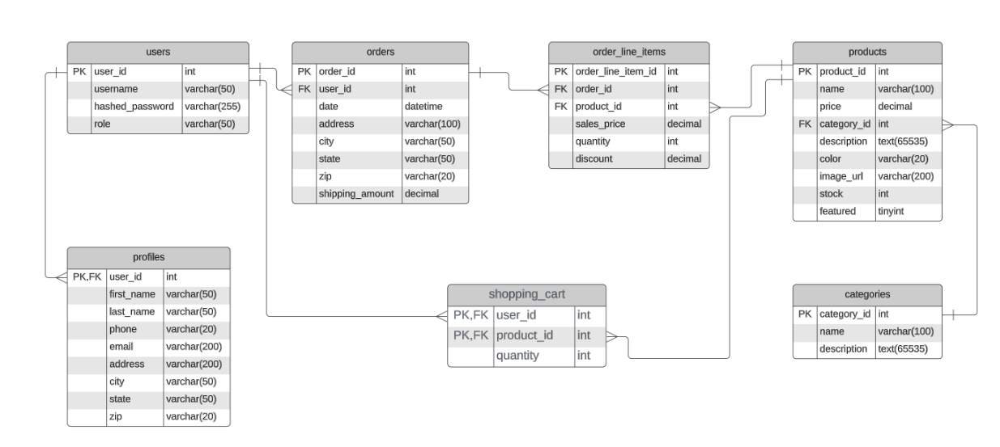

# Video Game Store

The Video Game Store allows users to browse a variety of games available in the store. Users can filter games by category, genre, and price. 
Logged-in users can add games to their cart to view the total cost and decide whether to complete a purchase.

## User Stories

- As a user, I want to view all game categories, so I can browse games by type- As a user, I want to add garlic knots and drinks to my order, so I can complete my meal in one checkout. 
- As a user, I want to view a single game category, so I can see its details.
- As a user, I want to add a new game category, so I can organize the store.
- As a user, I want to see all games in a category, so I can find games I like.
- As a user, I want to update a game category, so I can change its information.
- As a user, I want to delete a game category, so I can remove unused categories.

## Setup

### Prerequisites

- IntelliJ IDEA: Ensure you have IntelliJ IDEA installed, which you can download from [here](https://www.jetbrains.com/idea/download/).
- Java SDK: Make sure Java SDK is installed and configured in IntelliJ.

### Running the Application in IntelliJ

Follow these steps to get your application running within IntelliJ IDEA:

1. Open IntelliJ IDEA.
2. Select "Open" and navigate to the directory where you cloned or downloaded the project.
3. After the project opens, wait for IntelliJ to index the files and set up the project.
4. Find the main class with the `public static void main(String[] args)` method.
5. Right-click on the file and select 'Run 'Main.java' to start the application.

## Technologies Used

- Java 17
- IntelliJ Idea.
- Insomnia
- MySql

## Demo

## Class Diagram

## Resources

- [Dates and Times](https://docs.oracle.com/javase/8/docs/api/java/time/LocalDate.html)
- Previous exercises

## Thanks

- Thank you to Raymond Maroun for helping me with multiple parts of my code.
- Thanks to Rahinur and Roger for guidance.
